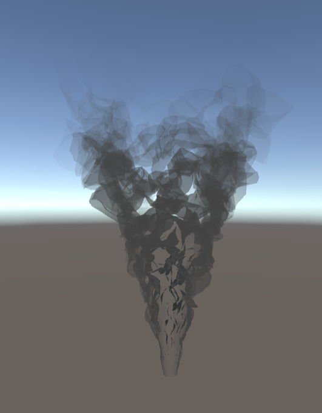

# Lab 07 - Smoke with Unity's Shader Graph
Let's continue practicing with Unity's shader graph to make
a smoke shader based on [this presentation](https://youtu.be/aYZEmaQUrAo?t=22m11s) by Simon Trumpler.

## Introduction

You will create a Unity project and make within it a Shader Graph
shader to turn a cylinder mesh into a cloud of smoke.
__Make sure it's the Universal Render Pipeline version so you don't need to import the shader graph package.__

When you create the project, you should import at least the cylinder OBJ file provided below. You should also follow these steps to make a custom shader graph:
- Right click -> Create -> Shader Graph -> BuiltIn -> Unlit

When you open the shader graph editor, you should also make sure
the shader uses transparency by going to:
- Graph Inspector -> Graph Settings -> Surface Type -> Transparent

## What’s provided:
We have a few assets that you can use in the project:
- A [mesh](smoke_cylinder.obj) on which to use your smoke material.
- A [Perlin noise generator](http://kitfox.com/projects/perlinNoiseMaker/) you can use to make a tiled noise texture to sample when displacing
your vertices. For an even smokier look, try making several different noise textures with different frequencies, and animate them at different speeds.
- A [black-white gradient texture](smoke_gradient.png) you may use to adjust the intensity of your vertex displacement and/or alter your mesh's transparency.

## Lab Puzzle:
Your goal is to mimic as closely as you can the techniques described in the game dev tech talk to create a smoke cloud. Your smoke should have the following attributes:
- Displace your vertices by adding to them the mesh's surface normals that have themselves been added to a Perlin noise texture
- The Perlin noise texture should apply a positive and negative displacement; this means you'll need to use some math nodes to remap the RGB value to the range [-1, 1]
- The vertex displacement should be minimal at the bottom of the cylinder and extreme at the top of the cylinder
- The smoke should animate over time
- The fragment output of your shader should be __opaque when viewed at a glancing angle__ and __transparent when viewed head-on__.
- The smoke should fade into transparency at its top

## Hints
Here are the nodes we used to complete our implementation. You are free to implement the shader however you choose, but these might help you:
- Time
- Multiply
- Add
- Subtract
- Dot Product
- One Minus
- Vector 2
- Tiling and Offset
- Sample Texture 2D LOD (__This kind of sampler must be used when using a texture to affect vertex position__)
- Sample Texture 2D (__This kind of sampler must be used when using a texture to affect fragment color__)
- Normal Vector (object space)
- Position (object space)

## Extra Credit:
 * Make the smoke follow the motion of the cylinder's base

# Submission:
- Create a pull request against this repository
- In your readme, add a GIF or video of your results!
